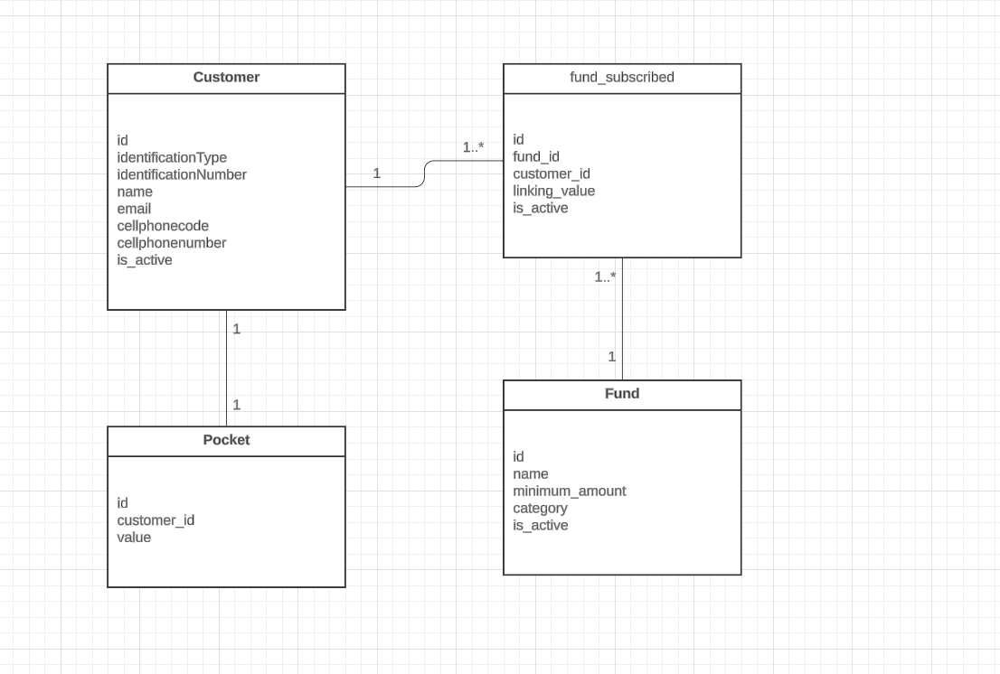

# Api Rest para la gestion de fondo voluntario de pension.

Esta api rest permite al cliente gestionar sus fondos de inversion

## Estructura:
* **Applications:** Esta capa se encarga de arrancar la aplicacíon y ademas en el se encuentran configuraciones generales del api. En el se encuentra el siguiente modulo:
  * **vpf-service**: Este modulo se encarga de arrancar la aplicacíon y intanciar los bean de los caso de usos que se usaran de forma general en la aplicacion.

* **Domain:** Es el nucleo de la aplicacion y en esta se encuetran las entidades core de negocio y los casos de uso. En esta capa se encuentran los siguientes modulos:
    * **Model**: En este modulo se encuentran las entidades core del negocio.
    * **Use Case** En este modulo se encuentran los casos de uso.

* **infrastructure:** En esta capa se encuentran los componentes de entrada y salida como adaptadores y punto de entrada de la aplicacion y esta compuesta por los siguientes modulos:
    * **driven-adapters.persistence:** Este modulo se encarga de interactuar con la base de ddatos.
    * **entry-points.web-vpf:** Este modulo es el punto de entrada de la aplicaccion, es donde se encuentran los controladores y endpoints. 

## Configuracion: 

* **Java Version**: Esta aplicacion esta desarrollada bajo la version 17 de Java.

## ¿Como probar?
Se agrega colleccion postman para realizar las pruebas: prueba-tecnica-btg.postman_collection.json

## Modelo de datos
